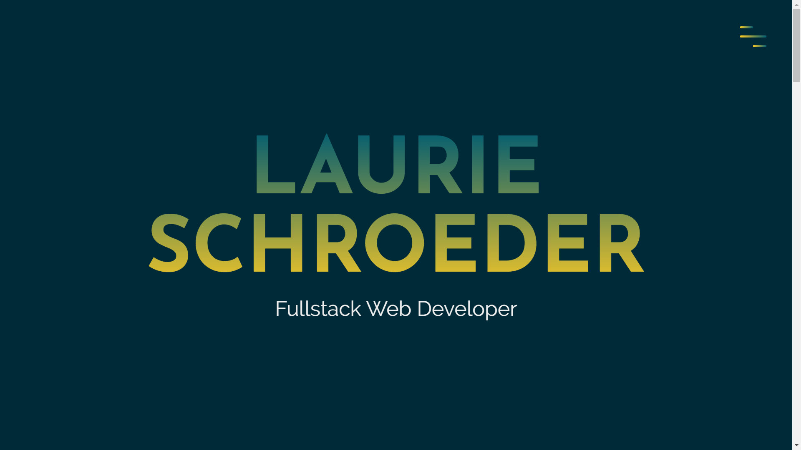

        

# Portfolio
An new layout format of my portfolio utilizing the AOS css animation framework. This project will also hosted outside of github to expand my knowledge of hosting processes. 

### [Deployed Webpage](https://clauries.github.io/portfolio-website/) 

## Concept
AS a bootcamp graduate,
I WANT to have a space to display my work
SO THAT potential employers, mentors, and teammates can find me and review my work.

## Tech Utilized
* HTML
* CSS
* Javascript
* jQuery
* AOS
* Font Awesome

## Future Development
* Deployment to personal website.
* Additional animation components.
* Utilize another CSS framework to create cards in place of the images in the portfolio section. Front of cards will be images. These cards will be animated to flip as a mouse moves over them revealing a description and the links. 
* Utilize another animation framework to develop animation in header where there is some additional space. Design/animation to be determined.

## Credits
* Responsive layout and instruction on utilizing AOS was adapted from a youtube tutorial by Julio Codes over 2 videos. Check out [video 1](https://youtu.be/T7PnWnTgusc) for layout and [video 2](https://youtu.be/inCl01EJkts) for AOS animation.
* AOS animations is an open source css framework. Please check it out [here](https://bit.ly/2EDiVLl).
* The color palette was curated by [Color Palettes](https://colorpalettes.net/color-palette-971/).

## License

MIT License

Copyright (c) 2020 Laurie J Schroeder

Permission is hereby granted, free of charge, to any person obtaining a copy
of this software and associated documentation files (the "Software"), to deal
in the Software without restriction, including without limitation the rights
to use, copy, modify, merge, publish, distribute, sublicense, and/or sell
copies of the Software, and to permit persons to whom the Software is
furnished to do so, subject to the following conditions:

The above copyright notice and this permission notice shall be included in all
copies or substantial portions of the Software.

THE SOFTWARE IS PROVIDED "AS IS", WITHOUT WARRANTY OF ANY KIND, EXPRESS OR
IMPLIED, INCLUDING BUT NOT LIMITED TO THE WARRANTIES OF MERCHANTABILITY,
FITNESS FOR A PARTICULAR PURPOSE AND NONINFRINGEMENT. IN NO EVENT SHALL THE
AUTHORS OR COPYRIGHT HOLDERS BE LIABLE FOR ANY CLAIM, DAMAGES OR OTHER
LIABILITY, WHETHER IN AN ACTION OF CONTRACT, TORT OR OTHERWISE, ARISING FROM,
OUT OF OR IN CONNECTION WITH THE SOFTWARE OR THE USE OR OTHER DEALINGS IN THE
SOFTWARE.

